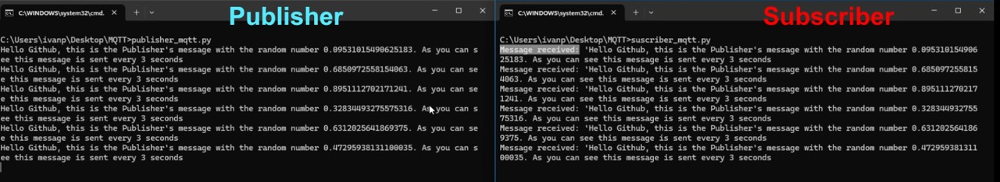

# MQTT BROKER PROJECT: Publisher/Subscriber

This is a simple project demonstrating how to implement an MQTT Publisher and Subscriber using Python and the `paho-mqtt` library. The project is deployed using Docker with the `eclipse-mosquitto` image (version 1.4.8) as the MQTT broker.

The project consists of:
- **Using Docker** with the image needed running.
- **Two Python Scripts**:
  - **⬆️ Publisher**: Publishes a message to a specified MQTT topic.
  - **️⬇️ Subscriber**: Subscribes to the same MQTT topic and receives the published message.
    

We had some issues during the project as the newest version of eclipse-mosquitto made it difficult to the subscriber to get the message, so I decided to use the 1.4.8 version instead

I had so much fun exploring this protocol and learning how it works as well as how to modify the scripts so a subscriber can also be a publisher. The posibilities are limitless, once you have this you can store the data and operate with it, or send it somewhere to create valuable information. So fun!🎉
